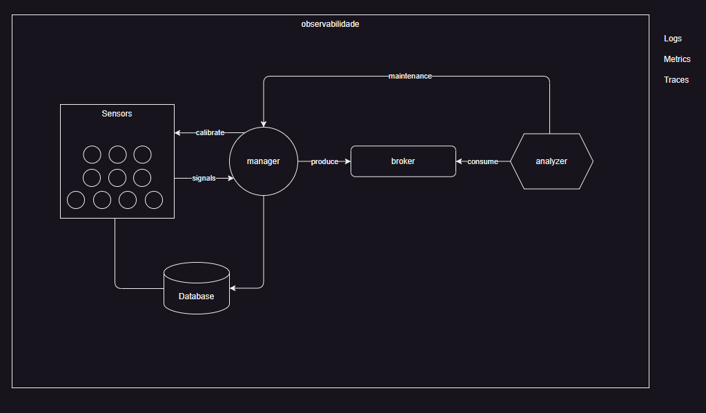

## Contexto

Empresa OAP-Gas fornece uma solução para distribuição de gás.  
Oferece a facilidade para manter um fluxo de gás constante ao cliente.  

#### Tecnologia
Conta com uma série de conexões no pais para distribuição de gás, o serviço é cobrado pelo transporte, valor do gás e valor de serviço pela disponibilidade.  
Atua com uma série de sensores de pressão para verificar o fluxo de gas e uma central de alta disponibilidade com todas as conexões dos sensores.  

## Problemas
Abaixo os problemas com pioriodade para resolução.  

- Sensores de pressão perdem calibração isso deixa os calculos de transmissão incertos.  
- Recalibrações constantes deixam os sensores indisponíveis, não é cobrado o trafego durante perído de cabibragem.  
- Identificação dos sensores com maiores frequencias de problemas, para troca com o fornecedor.  
- Tempo de resposta dos sensores é alto quando estao com a problema de calibragem. 

## Proposta

Criar uma plataforma para realizar a coleta de dados dos sensores.  
A aplicação deve organizar as informaçõe e analizar os dados dos sensores.  
A aplicação deve enviar os comandos de calibragem dos sensores.  
Criar metricas para os sensores.  

## Arquitetura

- .Net API gerenciamento dos sensores
- .Net API simulador de sensores
- .Net Serviço analizador
- .Net Aspire Open Telemetry
- Broker de mensagens Mass Transit com RabbitMQ
- Banco de dados Postgres com EFCore
- Docker Desktop para containers

## Observabilidade

Inicializando o aspire app host é possível realizar os testes de ponta a ponta simulando a aplicação

- Pode ser utilizada a api para simular os processos dos sensores  
  - Obter os sensores  
  - Envio dos sinais  
  - Descalibrar e Calibrar um sensor.  

- Database gerado com docker e apire

- Logs estruturados após as requisições e comunicação dos serviços

- Traces mostra a comunicação entre todos os serviços definidos na arquitetura
  

- Metricas configuradas manualmente para identificar os pontos de interesse na execução
dos processos
  
  